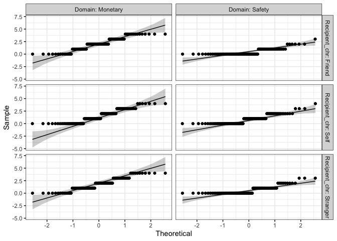

The Role of Social Distance in Surrogate Decision Making Involving Risks
================
Eva Wu

-   [Data Cleaning](#data-cleaning)
-   [Descriptives](#descriptives)
-   [Exploratory Data Analysis](#exploratory-data-analysis)
    -   [Gender Distribution](#gender-distribution)
    -   [Age Distribution](#age-distribution)
    -   [Risk-taking by Gender](#risk-taking-by-gender)
    -   [Risk-taking by Recipient and
        Domain](#risk-taking-by-recipient-and-domain)
-   [Check ANOVA Assumptions](#check-anova-assumptions)
    -   [Outliers](#outliers)
    -   [Normality](#normality)
    -   [Homogeneity of variance](#homogeneity-of-variance)
-   [Two-way Mixed Analysis of Variance
    (ANOVA)](#two-way-mixed-analysis-of-variance-anova)
-   [Conclusions](#conclusions)
-   [Session info](#session-info)

## Data Cleaning

    ## # A tibble: 285 × 7
    ##       id Sex      Age Recipient Recipient_chr MTotal STotal
    ##    <dbl> <chr>  <dbl>     <dbl> <chr>          <dbl>  <dbl>
    ##  1 21482 Female    18         3 Stranger           2      0
    ##  2 21595 Male      19         2 Friend             2      2
    ##  3 21753 Female    19         1 Self               1      1
    ##  4 21713 Female    19         3 Stranger           3      0
    ##  5 21564 Female    18         1 Self               2      1
    ##  6 21419 Female    19         2 Friend             3      0
    ##  7 21359 Male      20         2 Friend             3      0
    ##  8 21418 Male      20         3 Stranger           3      0
    ##  9 21460 Female    19         2 Friend             2      0
    ## 10 21495 Female    22         1 Self               3      1
    ## # … with 275 more rows

This shows the my dataset in a nutshell. Each participant has a unique
“id” generated by Qualtrics. Each row has data for one participant.
“Recipient” stands for whom participants were deciding for, and was
coded as numeric values, with 1 meaning self, 2 meaning friend, while 3
meaning stranger (a typical student at Wake Forest University). I
created a “Recipient_chr” column to recode “Recipient” into strings.
MTotal stands for the total number of riskier choices in the monetary
domain, while STotal stands for the total number of riskier choices in
the safety domain. Both MTotal and STotal range from 0 to 4, with 0
meaning the participant chose the safer option throughout, while 4
meaning the participant chose the riskier option throughout.

## Descriptives

| Recipient | Mean Monetary | SD Monetary | Mean Safety | SD Safety |
|:----------|--------------:|------------:|------------:|----------:|
| Self      |      1.510417 |    1.273163 |   0.8854167 | 0.9161681 |
| Friend    |      2.042553 |    1.269281 |   0.4468085 | 0.6658655 |
| Stranger  |      1.821053 |    1.228898 |   0.6105263 | 0.8028505 |
| Total     |      1.789474 |    1.271807 |   0.6491228 | 0.8198941 |

Table 1. Descriptive Statistics

This table shows the mean and standard deviation of each group. Both
“Mean Monetary” and “Mean Safety” range from 0 to 4, with 0 indicating
no riskier choices made, while 4 indicating no safer choices made. The
greater the value, the higher level of risk-taking. The “Total” row
shows the mean and standard deviation of risk-taking in the monetary and
safety domains regardless of decision recipient.

## Exploratory Data Analysis

### Gender Distribution

<!-- -->

As shown in Fig. 1, the number of male and female participants in this
study were approximately the same.

### Age Distribution

<!-- -->

As shown in Fig. 2, the age of participants ranged from 18 to 23. Most
participants were at the age of 19. Very few were above 22. This might
be due to the fact that students in Introductory Psychology were mostly
freshmen or sophomores.

### Risk-taking by Gender

<!-- -->

As shown in Fig. 3, it seems that for both monetary and safety domains,
females were a little more risk-taking than males.

### Risk-taking by Recipient and Domain

<!-- -->

This line graph compares the mean level of risk-taking across recipients
and domains. The red line represents the monetary domain, while the
green line represents the safety domain. As shown in Fig. 4, in the
monetary scenarios, participants made riskier decisions for their
friends than for stranger than for self. However, in the safety
scenarios, it was the reverse – participants made more risk-averse
decisions for their friends than for stranger than for self. This plot
is for exploratory data analysis. Since there’s an interesting trend, I
performed an ANOVA test below to see which relationships were
significant.

## Check ANOVA Assumptions

### Outliers

There are 5 outliers, but none of them was extreme, so I left them as
is.

### Normality

    ## 
    ##  Shapiro-Wilk normality test
    ## 
    ## data:  pivoted_data$`Risk-taking`
    ## W = 0.8486, p-value < 2.2e-16

<!-- -->

### Homogeneity of variance

    ## # A tibble: 1 × 4
    ##     df1   df2 statistic        p
    ##   <int> <int>     <dbl>    <dbl>
    ## 1     5   564      10.8 6.89e-10

It’s OK that these assumptions were violated, because our sample was
large and balanced, and we will use Greenhouse Geisser correction in our
ANOVA results.

## Two-way Mixed Analysis of Variance (ANOVA)

| Effect           | DFn | DFd |       F |        p | p\<.05 |      ges |
|:-----------------|----:|----:|--------:|---------:|:-------|---------:|
| Recipient        |   2 | 282 |   0.091 | 9.13e-01 |        | 0.000337 |
| Domain           |   1 | 282 | 174.947 | 0.00e+00 | \*     | 0.229000 |
| Recipient:Domain |   2 | 282 |  10.666 | 3.42e-05 | \*     | 0.035000 |

Table 2. ANOVA results

Results from a two-way repeated-measures factorial ANOVA showed a
significant main effect of decision domain on participants’ risk taking,
as compared between the monetary domain (*M* = 1.79, *SD* = 1.27) and
the safety domain (*M* = 0.65, *SD* = 0.82). On average, people were
more risk-taking in the monetary than safety domain, *F*(1, 282) =
174.95, *p* \< .001. Results from a two-way repeated-measures factorial
ANOVA showed no significant main effect of social distance on
participants’ risk-taking, as compared among those who decided for
themselves, those who decided for their friend, as well as those who
decided for a typical student on campus, *F*(2, 282) = 0.09, *p* = .91.
Those who made decisions for themselves, their friend, and a typical
student had no difference in risk taking while making their decisions.
There was a significant interaction between social distance and decision
domain, *F*(2, 282) = 10.67, *p* \< .001. The trend is demonstrated in
Fig. 4.

## Conclusions

In this assignment, I first imported data that I collected, tidied the
data frame, and presented a kable table of the descriptives. Then, I
performed some exploratory data analyses with regards to gender, age,
domain, recipient, and risk-taking. Then I checked for outliers,
performed ANOVA test. From evidence presented in this study, I concluded
that people were more risk-taking in the monetary than safety domain,
and that people made the most risky decisions for their friends in the
monetary domain and for themselves in the safety domain, but the most
risk-averse decisions for their friends in the safety domain and for
themselves in the monetary domain. More to explore in the future!

## Session info

    ## ─ Session info ───────────────────────────────────────────────────────────────
    ##  setting  value
    ##  version  R version 4.1.2 (2021-11-01)
    ##  os       macOS Monterey 12.1
    ##  system   aarch64, darwin20
    ##  ui       X11
    ##  language (EN)
    ##  collate  en_US.UTF-8
    ##  ctype    en_US.UTF-8
    ##  tz       America/Chicago
    ##  date     2022-09-19
    ##  pandoc   2.17.1.1 @ /Applications/RStudio.app/Contents/MacOS/quarto/bin/ (via rmarkdown)
    ## 
    ## ─ Packages ───────────────────────────────────────────────────────────────────
    ##  package       * version date (UTC) lib source
    ##  abind           1.4-5   2016-07-21 [1] CRAN (R 4.1.0)
    ##  assertthat      0.2.1   2019-03-21 [1] CRAN (R 4.1.0)
    ##  backports       1.4.1   2021-12-13 [1] CRAN (R 4.1.1)
    ##  bit             4.0.4   2020-08-04 [1] CRAN (R 4.1.1)
    ##  bit64           4.0.5   2020-08-30 [1] CRAN (R 4.1.0)
    ##  broom           1.0.1   2022-08-29 [1] CRAN (R 4.1.1)
    ##  cachem          1.0.6   2021-08-19 [1] CRAN (R 4.1.1)
    ##  callr           3.7.2   2022-08-22 [1] CRAN (R 4.1.1)
    ##  car             3.1-0   2022-06-15 [1] CRAN (R 4.1.1)
    ##  carData         3.0-5   2022-01-06 [1] CRAN (R 4.1.1)
    ##  cellranger      1.1.0   2016-07-27 [1] CRAN (R 4.1.0)
    ##  cli             3.4.0   2022-09-08 [1] CRAN (R 4.1.2)
    ##  colorspace      2.0-3   2022-02-21 [1] CRAN (R 4.1.1)
    ##  crayon          1.5.1   2022-03-26 [1] CRAN (R 4.1.1)
    ##  DBI             1.1.3   2022-06-18 [1] CRAN (R 4.1.1)
    ##  dbplyr          2.2.1   2022-06-27 [1] CRAN (R 4.1.1)
    ##  devtools        2.4.4   2022-07-20 [1] CRAN (R 4.1.1)
    ##  digest          0.6.29  2021-12-01 [1] CRAN (R 4.1.1)
    ##  dplyr         * 1.0.10  2022-09-01 [1] CRAN (R 4.1.1)
    ##  ellipsis        0.3.2   2021-04-29 [1] CRAN (R 4.1.0)
    ##  evaluate        0.16    2022-08-09 [1] CRAN (R 4.1.1)
    ##  fansi           1.0.3   2022-03-24 [1] CRAN (R 4.1.1)
    ##  farver          2.1.1   2022-07-06 [1] CRAN (R 4.1.1)
    ##  fastmap         1.1.0   2021-01-25 [1] CRAN (R 4.1.0)
    ##  forcats       * 0.5.2   2022-08-19 [1] CRAN (R 4.1.1)
    ##  fs              1.5.2   2021-12-08 [1] CRAN (R 4.1.1)
    ##  gargle          1.2.1   2022-09-08 [1] CRAN (R 4.1.2)
    ##  generics        0.1.3   2022-07-05 [1] CRAN (R 4.1.1)
    ##  ggplot2       * 3.3.6   2022-05-03 [1] CRAN (R 4.1.1)
    ##  ggpubr        * 0.4.0   2020-06-27 [1] CRAN (R 4.1.0)
    ##  ggsignif        0.6.3   2021-09-09 [1] CRAN (R 4.1.1)
    ##  glue            1.6.2   2022-02-24 [1] CRAN (R 4.1.1)
    ##  googledrive     2.0.0   2021-07-08 [1] CRAN (R 4.1.0)
    ##  googlesheets4   1.0.1   2022-08-13 [1] CRAN (R 4.1.1)
    ##  gtable          0.3.1   2022-09-01 [1] CRAN (R 4.1.1)
    ##  haven           2.5.1   2022-08-22 [1] CRAN (R 4.1.1)
    ##  here          * 1.0.1   2020-12-13 [1] CRAN (R 4.1.0)
    ##  highr           0.9     2021-04-16 [1] CRAN (R 4.1.0)
    ##  hms             1.1.2   2022-08-19 [1] CRAN (R 4.1.1)
    ##  htmltools       0.5.3   2022-07-18 [1] CRAN (R 4.1.1)
    ##  htmlwidgets     1.5.4   2021-09-08 [1] CRAN (R 4.1.1)
    ##  httpuv          1.6.6   2022-09-08 [1] CRAN (R 4.1.2)
    ##  httr            1.4.4   2022-08-17 [1] CRAN (R 4.1.1)
    ##  jsonlite        1.8.0   2022-02-22 [1] CRAN (R 4.1.1)
    ##  knitr         * 1.40    2022-08-24 [1] CRAN (R 4.1.1)
    ##  labeling        0.4.2   2020-10-20 [1] CRAN (R 4.1.0)
    ##  later           1.3.0   2021-08-18 [1] CRAN (R 4.1.1)
    ##  lifecycle       1.0.2   2022-09-09 [1] CRAN (R 4.1.2)
    ##  lubridate       1.8.0   2021-10-07 [1] CRAN (R 4.1.1)
    ##  magrittr        2.0.3   2022-03-30 [1] CRAN (R 4.1.1)
    ##  memoise         2.0.1   2021-11-26 [1] CRAN (R 4.1.1)
    ##  mime            0.12    2021-09-28 [1] CRAN (R 4.1.1)
    ##  miniUI          0.1.1.1 2018-05-18 [1] CRAN (R 4.1.0)
    ##  modelr          0.1.9   2022-08-19 [1] CRAN (R 4.1.1)
    ##  munsell         0.5.0   2018-06-12 [1] CRAN (R 4.1.0)
    ##  pillar          1.8.1   2022-08-19 [1] CRAN (R 4.1.1)
    ##  pkgbuild        1.3.1   2021-12-20 [1] CRAN (R 4.1.1)
    ##  pkgconfig       2.0.3   2019-09-22 [1] CRAN (R 4.1.0)
    ##  pkgload         1.3.0   2022-06-27 [1] CRAN (R 4.1.1)
    ##  prettyunits     1.1.1   2020-01-24 [1] CRAN (R 4.1.0)
    ##  processx        3.7.0   2022-07-07 [1] CRAN (R 4.1.1)
    ##  profvis         0.3.7   2020-11-02 [1] CRAN (R 4.1.0)
    ##  promises        1.2.0.1 2021-02-11 [1] CRAN (R 4.1.0)
    ##  ps              1.7.1   2022-06-18 [1] CRAN (R 4.1.1)
    ##  purrr         * 0.3.4   2020-04-17 [1] CRAN (R 4.1.0)
    ##  R6              2.5.1   2021-08-19 [1] CRAN (R 4.1.1)
    ##  Rcpp            1.0.9   2022-07-08 [1] CRAN (R 4.1.1)
    ##  readr         * 2.1.2   2022-01-30 [1] CRAN (R 4.1.1)
    ##  readxl          1.4.1   2022-08-17 [1] CRAN (R 4.1.1)
    ##  remotes         2.4.2   2021-11-30 [1] CRAN (R 4.1.1)
    ##  reprex          2.0.2   2022-08-17 [1] CRAN (R 4.1.1)
    ##  rlang           1.0.5   2022-08-31 [1] CRAN (R 4.1.1)
    ##  rmarkdown       2.16    2022-08-24 [1] CRAN (R 4.1.1)
    ##  rprojroot       2.0.3   2022-04-02 [1] CRAN (R 4.1.1)
    ##  rstatix       * 0.7.0   2021-02-13 [1] CRAN (R 4.1.0)
    ##  rstudioapi      0.14    2022-08-22 [1] CRAN (R 4.1.1)
    ##  rvest           1.0.3   2022-08-19 [1] CRAN (R 4.1.1)
    ##  scales          1.2.1   2022-08-20 [1] CRAN (R 4.1.1)
    ##  sessioninfo     1.2.2   2021-12-06 [1] CRAN (R 4.1.1)
    ##  shiny           1.7.2   2022-07-19 [1] CRAN (R 4.1.1)
    ##  stringi         1.7.8   2022-07-11 [1] CRAN (R 4.1.1)
    ##  stringr       * 1.4.1   2022-08-20 [1] CRAN (R 4.1.1)
    ##  tibble        * 3.1.8   2022-07-22 [1] CRAN (R 4.1.1)
    ##  tidyr         * 1.2.1   2022-09-08 [1] CRAN (R 4.1.2)
    ##  tidyselect      1.1.2   2022-02-21 [1] CRAN (R 4.1.1)
    ##  tidyverse     * 1.3.2   2022-07-18 [1] CRAN (R 4.1.1)
    ##  tzdb            0.3.0   2022-03-28 [1] CRAN (R 4.1.1)
    ##  urlchecker      1.0.1   2021-11-30 [1] CRAN (R 4.1.1)
    ##  usethis         2.1.6   2022-05-25 [1] CRAN (R 4.1.1)
    ##  utf8            1.2.2   2021-07-24 [1] CRAN (R 4.1.0)
    ##  vctrs           0.4.1   2022-04-13 [1] CRAN (R 4.1.1)
    ##  vroom           1.5.7   2021-11-30 [1] CRAN (R 4.1.1)
    ##  withr           2.5.0   2022-03-03 [1] CRAN (R 4.1.1)
    ##  xfun            0.32    2022-08-10 [1] CRAN (R 4.1.1)
    ##  xml2            1.3.3   2021-11-30 [1] CRAN (R 4.1.1)
    ##  xtable          1.8-4   2019-04-21 [1] CRAN (R 4.1.0)
    ##  yaml            2.3.5   2022-02-21 [1] CRAN (R 4.1.1)
    ## 
    ##  [1] /Library/Frameworks/R.framework/Versions/4.1-arm64/Resources/library
    ## 
    ## ──────────────────────────────────────────────────────────────────────────────
