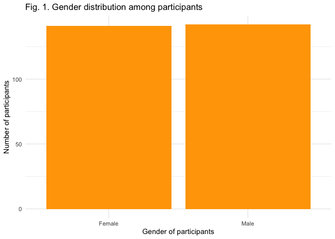
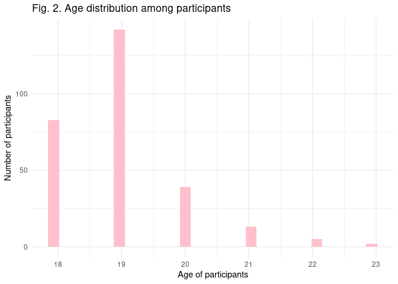
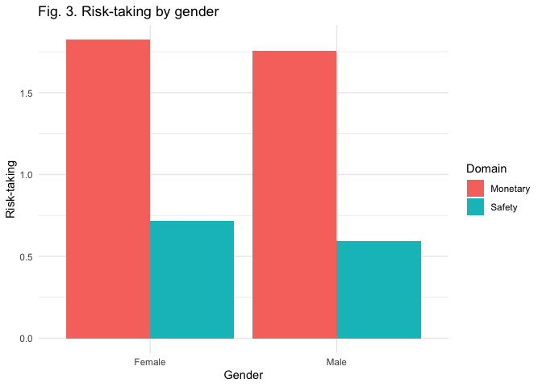
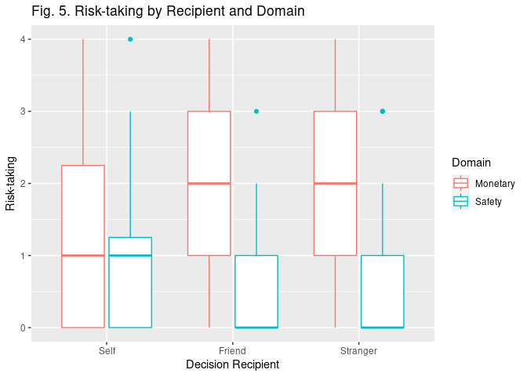
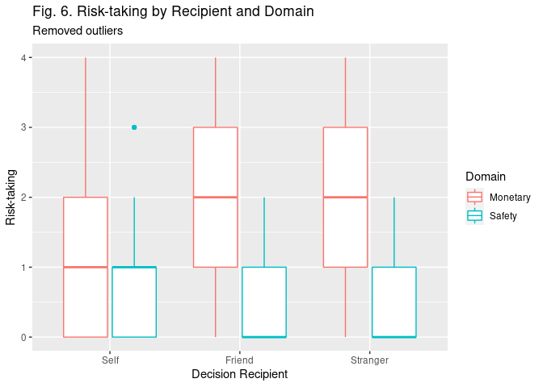

The Role of Social Distance in Surrogate Decision Making Involving Risks
================
Eva Wu

-   [Introduction](#introduction)
-   [Descriptives](#descriptives)
-   [Exploratory Data Analysis](#exploratory-data-analysis)
    -   [Gender Distribution](#gender-distribution)
    -   [Age Distribution](#age-distribution)
    -   [Risk-taking by Gender](#risk-taking-by-gender)
    -   [Risk-taking by Recipient and
        Domain](#risk-taking-by-recipient-and-domain)
-   [Check for Outliers](#check-for-outliers)
-   [Two-way Mixed Analysis of Variance
    (ANOVA)](#two-way-mixed-analysis-of-variance-anova)
-   [Conclusions](#conclusions)
-   [Session info](#session-info)

## Introduction

In this assignment, I cleaned and analyzed the data I collected for my
undergraduate honors thesis at Wake Forest University.

In this research project, I explored whether social distance (also
referred to as psychological distance, or closeness of relationship) and
decision domain play a role in self-other differences in decision
making. 287 students from Introductory Psychology course at Wake Forest
University were recruited via the SONA system. Participants were
randomly assigned to one of 3 conditions, asking them to decide for **1)
self 2) a friend, or 3) a typical Wake Forest Student**. They each read
short scenarios in the **monetary and safety domains** (a total of 8
scenarios, 4 for monetary and 4 for safety situations respectively) and
chose one from the two options involving different levels of risk taking
(risk-seeking vs. risk-averse). The total number of riskier choices was
compared across conditions.

Just to provide more background, I am including sample scenarios
participants read in the experiment.

\[*Monetary scenario for “self” condition*\] You are playing a poker
game. Now, you have two options. One option is to end the game
immediately. If you choose this option, you will win $10. Another option
is to continue to play the game. If you choose this option, you will win
$100 with a chance of 10% or you will win nothing. Which option would
you choose for yourself?

A. End the game to win $10

B. Continue to play the game to win $100 with a chance of 10% and win
nothing with a chance of 90%

\[*Safety scenario for “friend” condition*\] Your friend is riding alone
in a taxi. After riding in the taxi for a while, it becomes apparent to
them that the driver is drunk. There are no other taxis around or other
means of transportation. Their destination is 5 miles away, and although
it is inconvenient, it is safe to walk. Which option would you choose
for your friend?

A. Get out of the taxi and walk

B. Remain in the taxi

This study was a 3 x 2 repeated-measures design, with **decision
recipients** (self vs. friend vs. typical Wake Forest student) as the
*between-subjects* factor, and the **decision domain** (monetary
vs. safety) as the *within-subjects* factor. The *dependent variable*
was **risk preference** in decision making, measured by total number of
participants’ risk-taking choices within each domain. Moreover, half of
the participants read the monetary scenarios first, while the other half
read the safety scenarios first, with order randomly assigned, in order
to eliminate order effect.

## Descriptives

| Recipient | Mean Monetary | SD Monetary | Mean Safety | SD Safety |
|:----------|--------------:|------------:|------------:|----------:|
| Self      |      1.510417 |    1.273163 |   0.8854167 | 0.9161681 |
| Friend    |      2.042553 |    1.269281 |   0.4468085 | 0.6658655 |
| Stranger  |      1.821053 |    1.228898 |   0.6105263 | 0.8028505 |
| Total     |      1.789474 |    1.271807 |   0.6491228 | 0.8198941 |

Table 1. Descriptive Statistics

This table shows the mean and standard deviation of each group. Both
“Mean Monetary” and “Mean Safety” range from 0 to 4, with 0 indicating
no riskier choices made, while 4 indicating no safer choices made. The
greater the value, the higher level of risk-taking. The “Total” row
shows the mean and standard deviation of risk-taking in the monetary and
safety domains regardless of decision recipient.

## Exploratory Data Analysis

### Gender Distribution

<!-- -->

As shown in Fig. 1, the number of male and female participants in this
study were approximately the same.

### Age Distribution

<!-- -->

As shown in Fig. 2, the age of participants ranged from 18 to 23. Most
participants were at the age of 19. Very few were above 22. This might
be due to the fact that students in Introductory Psychology were mostly
freshmen or sophomores.

### Risk-taking by Gender

<!-- -->

As shown in Fig. 3, it seems that for both monetary and safety domains,
females were a little more risk-taking than males.

### Risk-taking by Recipient and Domain

<!-- -->

This line graph compares the mean level of risk-taking across recipients
and domains. The red line represents the monetary domain, while the
green line represents the safety domain. As shown in Fig. 4, in the
monetary scenarios, participants made riskier decisions for their
friends than for stranger than for self. However, in the safety
scenarios, it was the reverse – participants made more risk-averse
decisions for their friends than for stranger than for self. This plot
is for exploratory data analysis. Since there’s an interesting trend, I
performed an ANOVA test below to see which relationships were
significant.

## Check for Outliers

<!-- -->

From this boxplot, we could see that there is one outlier for each of
the recipient conditions. Just to be cautious, I decided to remove the
outliers, and compare the results with and without outliers to see if
they differ.

<!-- -->

From this graph we see that those outliers above have been successfully
removed. There is a new outlier but since it’s not too extreme I left it
as is.

## Two-way Mixed Analysis of Variance (ANOVA)

| Effect           | DFn | DFd |       F |       p | p&lt;.05 |      ges |
|:-----------------|----:|----:|--------:|--------:|:---------|---------:|
| Recipient        |   2 | 277 |   0.262 | 7.7e-01 |          | 0.000985 |
| Domain           |   1 | 277 | 196.160 | 0.0e+00 | \*       | 0.253000 |
| Recipient:Domain |   2 | 277 |  12.017 | 9.9e-06 | \*       | 0.040000 |

Table 2. ANOVA test with outliers removed

| Effect           | DFn | DFd |       F |        p | p&lt;.05 |      ges |
|:-----------------|----:|----:|--------:|---------:|:---------|---------:|
| Recipient        |   2 | 282 |   0.091 | 9.13e-01 |          | 0.000337 |
| Domain           |   1 | 282 | 174.947 | 0.00e+00 | \*       | 0.229000 |
| Recipient:Domain |   2 | 282 |  10.666 | 3.42e-05 | \*       | 0.035000 |

Table 3. ANOVA test with outliers included

I performed ANOVA test twice, once with the outliers removed, and once
with the outliers included. Results did not differ much. As a result, I
am reporting the findings with outliers included.

Results from a two-way repeated-measures factorial ANOVA showed a
significant main effect of decision domain on participants’ risk taking,
as compared between the monetary domain (*M* = 1.79, *SD* = 1.27) and
the safety domain (*M* = 0.65, *SD* = 0.82). On average, people were
more risk-taking in the monetary than safety domain, *F*(1, 282) =
174.95, *p* &lt; .001. Results from a two-way repeated-measures
factorial ANOVA showed no significant main effect of social distance on
participants’ risk-taking, as compared among those who decided for
themselves, those who decided for their friend, as well as those who
decided for a typical student on campus, *F*(2, 282) = 0.09, *p* = .91.
Those who made decisions for themselves, their friend, and a typical
student had no difference in risk taking while making their decisions.
There was a significant interaction between social distance and decision
domain, *F*(2, 282) = 10.67, *p* &lt; .001. The trend is demonstrated in
Fig. 4.

## Conclusions

In this assignment, I first imported data that I collected, tidied the
data frame, and presented a kable table of the descriptives. Then, I
performed some explanatory data analyses with regards to gender, age,
domain, recipient, and risk-taking. Then I checked for outliers,
performed ANOVA twice with and without outliers, and found out that
results were similar in both cases. From evidence presented in this
study, I concluded that people were more risk-taking in the monetary
than safety domain, and that people made the most risky decisions for
their friends in the monetary domain and for themselves in the safety
domain, but the most risk-averse decisions for their friends in the
safety domain and for themselves in the monetary domain. More to explore
in the future!

## Session info

    ## ─ Session info ───────────────────────────────────────────────────────────────
    ##  setting  value                               
    ##  version  R version 4.0.1 (2020-06-06)        
    ##  os       Red Hat Enterprise Linux 8.4 (Ootpa)
    ##  system   x86_64, linux-gnu                   
    ##  ui       X11                                 
    ##  language (EN)                                
    ##  collate  en_US.UTF-8                         
    ##  ctype    en_US.UTF-8                         
    ##  tz       America/Chicago                     
    ##  date     2021-11-09                          
    ## 
    ## ─ Packages ───────────────────────────────────────────────────────────────────
    ##  package     * version date       lib source        
    ##  abind         1.4-5   2016-07-21 [1] CRAN (R 4.0.1)
    ##  assertthat    0.2.1   2019-03-21 [2] CRAN (R 4.0.1)
    ##  backports     1.2.1   2020-12-09 [2] CRAN (R 4.0.1)
    ##  bit           4.0.4   2020-08-04 [2] CRAN (R 4.0.1)
    ##  bit64         4.0.5   2020-08-30 [2] CRAN (R 4.0.1)
    ##  broom         0.7.9   2021-07-27 [2] CRAN (R 4.0.1)
    ##  cachem        1.0.5   2021-05-15 [2] CRAN (R 4.0.1)
    ##  callr         3.7.0   2021-04-20 [2] CRAN (R 4.0.1)
    ##  car           3.0-12  2021-11-06 [1] CRAN (R 4.0.1)
    ##  carData       3.0-4   2020-05-22 [1] CRAN (R 4.0.1)
    ##  cellranger    1.1.0   2016-07-27 [2] CRAN (R 4.0.1)
    ##  cli           3.0.1   2021-07-17 [2] CRAN (R 4.0.1)
    ##  colorspace    2.0-2   2021-06-24 [2] CRAN (R 4.0.1)
    ##  crayon        1.4.1   2021-02-08 [2] CRAN (R 4.0.1)
    ##  DBI           1.1.1   2021-01-15 [2] CRAN (R 4.0.1)
    ##  dbplyr        2.1.1   2021-04-06 [2] CRAN (R 4.0.1)
    ##  desc          1.3.0   2021-03-05 [2] CRAN (R 4.0.1)
    ##  devtools      2.4.2   2021-06-07 [2] CRAN (R 4.0.1)
    ##  digest        0.6.27  2020-10-24 [2] CRAN (R 4.0.1)
    ##  dplyr       * 1.0.7   2021-06-18 [2] CRAN (R 4.0.1)
    ##  ellipsis      0.3.2   2021-04-29 [2] CRAN (R 4.0.1)
    ##  evaluate      0.14    2019-05-28 [2] CRAN (R 4.0.1)
    ##  fansi         0.5.0   2021-05-25 [2] CRAN (R 4.0.1)
    ##  farver        2.1.0   2021-02-28 [2] CRAN (R 4.0.1)
    ##  fastmap       1.1.0   2021-01-25 [2] CRAN (R 4.0.1)
    ##  forcats     * 0.5.1   2021-01-27 [2] CRAN (R 4.0.1)
    ##  fs            1.5.0   2020-07-31 [2] CRAN (R 4.0.1)
    ##  generics      0.1.0   2020-10-31 [2] CRAN (R 4.0.1)
    ##  ggplot2     * 3.3.5   2021-06-25 [2] CRAN (R 4.0.1)
    ##  glue          1.4.2   2020-08-27 [2] CRAN (R 4.0.1)
    ##  gtable        0.3.0   2019-03-25 [2] CRAN (R 4.0.1)
    ##  haven         2.4.3   2021-08-04 [2] CRAN (R 4.0.1)
    ##  here        * 1.0.1   2020-12-13 [2] CRAN (R 4.0.1)
    ##  highr         0.9     2021-04-16 [2] CRAN (R 4.0.1)
    ##  hms           1.1.0   2021-05-17 [2] CRAN (R 4.0.1)
    ##  htmltools     0.5.2   2021-08-25 [2] CRAN (R 4.0.1)
    ##  httr          1.4.2   2020-07-20 [2] CRAN (R 4.0.1)
    ##  jsonlite      1.7.2   2020-12-09 [2] CRAN (R 4.0.1)
    ##  knitr       * 1.36    2021-09-29 [2] CRAN (R 4.0.1)
    ##  labeling      0.4.2   2020-10-20 [2] CRAN (R 4.0.1)
    ##  lifecycle     1.0.0   2021-02-15 [2] CRAN (R 4.0.1)
    ##  lubridate     1.7.10  2021-02-26 [2] CRAN (R 4.0.1)
    ##  magrittr      2.0.1   2020-11-17 [2] CRAN (R 4.0.1)
    ##  memoise       2.0.0   2021-01-26 [2] CRAN (R 4.0.1)
    ##  modelr        0.1.8   2020-05-19 [2] CRAN (R 4.0.1)
    ##  munsell       0.5.0   2018-06-12 [2] CRAN (R 4.0.1)
    ##  pillar        1.6.2   2021-07-29 [2] CRAN (R 4.0.1)
    ##  pkgbuild      1.2.0   2020-12-15 [2] CRAN (R 4.0.1)
    ##  pkgconfig     2.0.3   2019-09-22 [2] CRAN (R 4.0.1)
    ##  pkgload       1.2.1   2021-04-06 [2] CRAN (R 4.0.1)
    ##  prettyunits   1.1.1   2020-01-24 [2] CRAN (R 4.0.1)
    ##  processx      3.5.2   2021-04-30 [2] CRAN (R 4.0.1)
    ##  ps            1.6.0   2021-02-28 [2] CRAN (R 4.0.1)
    ##  purrr       * 0.3.4   2020-04-17 [2] CRAN (R 4.0.1)
    ##  R6            2.5.0   2020-10-28 [2] CRAN (R 4.0.1)
    ##  Rcpp          1.0.7   2021-07-07 [2] CRAN (R 4.0.1)
    ##  readr       * 2.0.1   2021-08-10 [2] CRAN (R 4.0.1)
    ##  readxl        1.3.1   2019-03-13 [2] CRAN (R 4.0.1)
    ##  remotes       2.4.0   2021-06-02 [2] CRAN (R 4.0.1)
    ##  reprex        2.0.1   2021-08-05 [1] CRAN (R 4.0.1)
    ##  rlang         0.4.11  2021-04-30 [2] CRAN (R 4.0.1)
    ##  rmarkdown     2.11    2021-09-14 [2] CRAN (R 4.0.1)
    ##  rprojroot     2.0.2   2020-11-15 [2] CRAN (R 4.0.1)
    ##  rstatix     * 0.7.0   2021-02-13 [1] CRAN (R 4.0.1)
    ##  rstudioapi    0.13    2020-11-12 [2] CRAN (R 4.0.1)
    ##  rvest         1.0.1   2021-07-26 [2] CRAN (R 4.0.1)
    ##  scales        1.1.1   2020-05-11 [2] CRAN (R 4.0.1)
    ##  sessioninfo   1.1.1   2018-11-05 [2] CRAN (R 4.0.1)
    ##  stringi       1.7.4   2021-08-25 [2] CRAN (R 4.0.1)
    ##  stringr     * 1.4.0   2019-02-10 [2] CRAN (R 4.0.1)
    ##  testthat      3.0.4   2021-07-01 [2] CRAN (R 4.0.1)
    ##  tibble      * 3.1.3   2021-07-23 [2] CRAN (R 4.0.1)
    ##  tidyr       * 1.1.3   2021-03-03 [2] CRAN (R 4.0.1)
    ##  tidyselect    1.1.1   2021-04-30 [2] CRAN (R 4.0.1)
    ##  tidyverse   * 1.3.1   2021-04-15 [2] CRAN (R 4.0.1)
    ##  tzdb          0.1.2   2021-07-20 [2] CRAN (R 4.0.1)
    ##  usethis       2.0.1   2021-02-10 [2] CRAN (R 4.0.1)
    ##  utf8          1.2.2   2021-07-24 [2] CRAN (R 4.0.1)
    ##  vctrs         0.3.8   2021-04-29 [2] CRAN (R 4.0.1)
    ##  vroom         1.5.4   2021-08-05 [2] CRAN (R 4.0.1)
    ##  withr         2.4.2   2021-04-18 [2] CRAN (R 4.0.1)
    ##  xfun          0.25    2021-08-06 [2] CRAN (R 4.0.1)
    ##  xml2          1.3.2   2020-04-23 [2] CRAN (R 4.0.1)
    ##  yaml          2.2.1   2020-02-01 [2] CRAN (R 4.0.1)
    ## 
    ## [1] /home/wux21/R/x86_64-pc-linux-gnu-library/4.0
    ## [2] /opt/R/4.0.1/lib/R/library
